# Data Literacy (Veri OkurYazarlığı)
## Veri Okuryazarlığı Nedir?
- Günlük hayatta veriyle temas ettiğimiz ilk anlardaki basit veri yorumlama kabiliyetidir.
- Her türden veri tipini, değişken ve ölçek türlerini tanımlayabilme, betimsel istatistikleri ve istatistiksel grafikleri kullanarak ve değerlendirebilme yeteneğidir.

---

## Population and Sample(Popülasyon ve Örneklem):
- Popülasyon ilgilendiğimiz ana kitledir.
- Örneklem, bu Popülasyondan seçilmiş bir alt kümedir.
  &rarr; Burada önemli olan nokta, **örneklemin** ana kitleyi yani **popülasyonu** çok iyi temsil etmesi gerekir. Gün sonunda örneklem, bu popülasyonmuşcasına muamele görecektir.

- Seçim anketleri bir örnektir. 80 milyonu temsil ettiği varsayılan (mesela)2500 kişi üzerinden anket yapılır ve bu anket sonuçları tüm Türkiye sonuçları olarak yayınlanır.

---

## Observation Unit(Gözlem Birimi)
- Gözlem birimi araştırmada incelediğimiz birimlerdir. Bir **popülasyondan** seçtiğimiz **örneklem** topluluğundaki her bir eleman, **gözlem birimi** olarak adlandırılır.
- Anket yapılan her birey gözlem birimidir.

---

## Variable and Variable Types(Değişken ve Değişken Türleri)
**Değişken**: Birimden birime farklı değerler alan niceliktir.
- Örneğin birkaç arabanın KM değerleri olduğunu düşünürsek, KM'ye **değişken** diyebiliriz. 
- Vites türü, Araç fiyatı hepsi birer değişkendir.

**Değişken Türleri:**
1. Sayısal Değişken (nicel, kantitatif)
2. Kategorik Değişkenler (nitel, kalitatif)
   
- "Cinsiyet" kategorik değişkendir. "Kadın", "Erkek" ise bu kategorik değişkenin sınıflarıdır.

Not: Karakterlerden oluşan değişkenlere kategorik değişkenler denir.

---

## Scales of Measurement(Ölçek Türleri)
**Ölçek:** Bir değişkenin değerlerini insan olarak okuyup anlayabilmemiz için bunu ölçmemiz gerekir.

**Ölçek Türleri**
- Sayısal değişkenler için: Aralık ve Oran
- Kategorik değişkenler için: Nominal ve Ordinal

**Aralık Türü**: Sıcaklık gibi başlangıç noktası sıfır(0) olmayan sayısal değişkenlerin ölçek türü *Aralık*tır.

**Oran Türü**: Başlangıç noktası sıfır kabul edilen sayısal değişkenlerin ölçek türü *Oran*dır. Aracın KM değeri gibi.

**Nominal Türü**: Kategorik değişkenlerin sınıfları arasında fark olmadığında buna ***Nominal*** ölçek türü ile ölçülmüştür denir.
- Örneğin "Cinsiyet" kategorisindesi "Erkek" ve "Kadın" sınıfları arasında fark yoktur. Bunlar Nominal ölçek ile ölçülmüştür.

**Ordinal Türü**: Kategorik değişkenlerin sınıfları arasında fark olduğunda buna ***Ordinal*** ölçek türü ile ölçülmüştür denir.
- Örneğin rütbeler sınıflandırıldığında Teğmen < Üsteğmen < ... < Tuğgeneral < Tümgeneral < Korgeneral < Orgeneral
- Başka bir örnekte eğitim durumu için verilebilir: ilkokul < ortaokul < lise < üniversite

---

## Arithmetic Mean(Aritmetik Ortalama)
**Aritmetik ortalama:** Bir seride(değişkende) yer alan tüm değerlerin toplanması ve birim sayısına bölünmesi ile elde edilen istatistiktir.
Örneğin;

---

## Median(Medyan)
**Medyan**: Bir seriyi küçükten büyüğe veya büyükten küçüğe sıraladğımazda tam orta noktadan seriyi iki eşit parçaya ayıran değere medyan denir. 
- Elimizdeki değişken veya serinin, merkezi eğilimiyle ilgili bilgi almak için kullanılır. 
- Medyanı hesaplamak için bir seriye odaklandığımızda serinin içermiş olduğu gözlem sayısına göre medyan hesaplama işlemleri farklılık gösterir:

- Eğer elimizdeki seri simetrik ise ancak o zaman bu seri ile ilgili aritmetik ortalama hesaplanabilir. Eğer elimizdeki seri yada değişkenin dağılımı simetrik değil ise bu durumda medyan hesaplanabilir. Çünkü elimizdeki serinin merkezini temsil eden bir değer arıyoruz. Eğer simetrik değilse ortalama yanıltıcı olabilir.
  

- İş hayatında veri ile konuşurken, merkezi eğilim ölçüleriyle konuşurken eğer medyan ve ortalama bahsi açıldıysa **mutlaka ve mutlaka** muhattaplara, ya ***"dağılım simetrik mi?"*** diye sormak gerek ya da muhttaplara bilgi verirken:
***"dağılım incelendiğinde dağılımın simetrik olduğu gözükmektedir. Bu sebeple aritmetik ortalaması budur."*** 
VEYA 
***"Dağılım incelendiğinde veri seti içerisinde bulunan bazı aykırılıklardan vb. sebeplerden dolayı ortaya simetrik olmama problemi çıkmıştır, bu sebeple bu değişkenin temsili değeri olarak medyan değerini sunuyorum, o değer de şudur"*** şeklinde bir sunum yapılması gerekmektedir.

---

## Mode(Mod)
Bir seride yada değişkende en çok tekrar eden değişkene **mod** adı verilir.
- Biraz daha algoritmik bir işlemdir.
  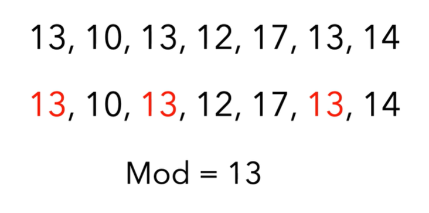

---

## Quartilles(Kartiller)
**Kartiller**: Hem merkezi eğilim ölçüsü olarak hem de dağılım ölçüsü olarak kullanılabilen kartiller, Küçükten büyüğe sıralanan bir seriyi 4 parçaya ayıran değerlere ***kartiller*** denir.

Kartiller şu şekilde hesaplanır:

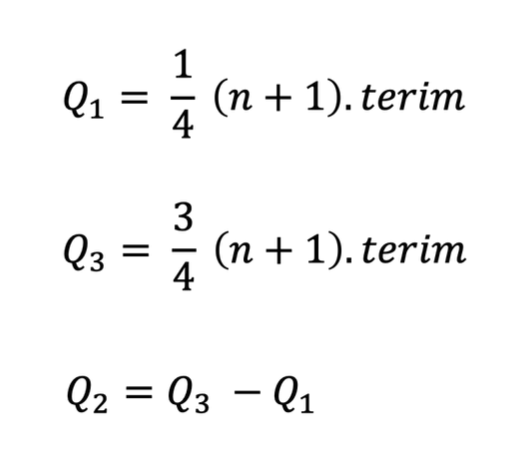

Kartiller, sadece serinin merkezinde bilgi vermekle kalmaz, aynı zamanda merkezin sağında ve solundaki eğilimleri - dağılımları da bize verir. Önemi buradan kaynaklanır.

---

# Dağılım ölçüleri
- Elimizdeki değişkenin/serinin değerlerinin ne şekilde dağıldığını ifade eden ölçülerdir. Elimizdeki değerlerin maksimum, mininmum değerleri veya ortalama etrafındaki durumunun ne olduğunu anlamaya çalışmak amaçlarıyla kullanılan ölçülerdir.
  
---
## Range(Değişim Aralığı)
- Bir değişkendeki veya serideki maksimum değerden minimum değeri çıkardığımızdaki elde ettiğimiz değerdir.
  
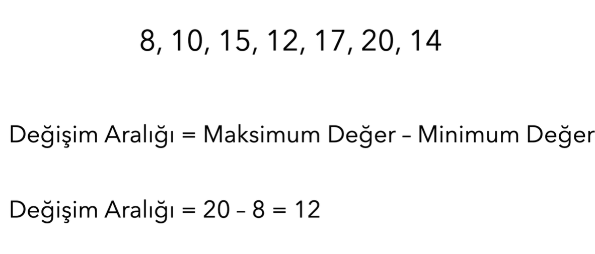

- İki farklı iş yerindeki belirli bir pozisyonda çalışanların maaş aralığı sorulduğunda (diyelim 1000 ve 10000) maaş aralığı 1000 olan iş yerinde maaşların birbirine daha yakın olduğu anlamı çıkar. Diğerinde ise maaşlar daha oynaktır.

---
## Standart Deviation(Standart Sapma)
- Ortalamadan olan sapmaların genel bir ölçüsüdür.

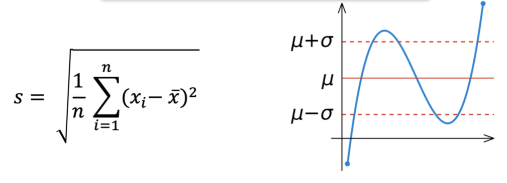

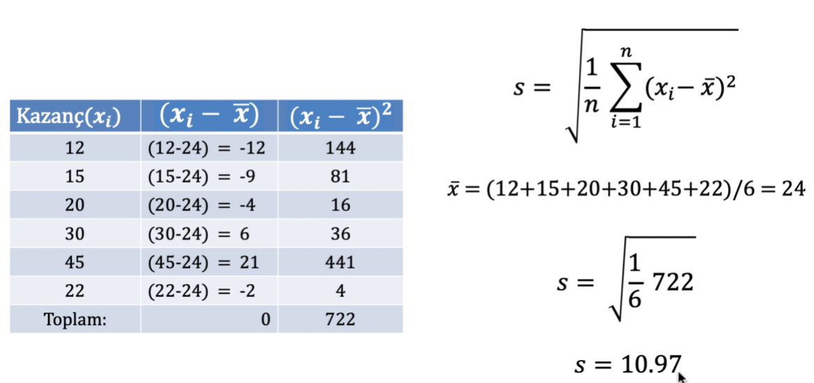

---
## Variance(Varyans)
- Standart sapmanın karesidir(Ortalamadan olan sapmaların karelerinin ortalamasıdır). 
- Birden fazla değişkenin dağılımını birbirleriyle kıyaslamak için kullanmak istediğimizde **varyans** kullanılması tercih edilebiliyor.

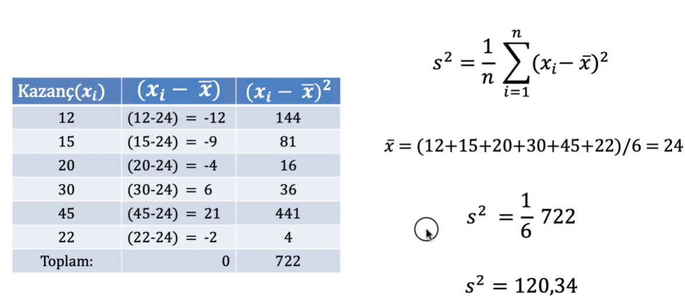

---
## Skewness(Çarpıklık)
- Çarpıklık bir değişkenin dağılımının simetrik olmayışıdır.
- Çarpıklık olduğu zaman medyan ile merkezi dağılım ölçüsü ifade edilir.
  
  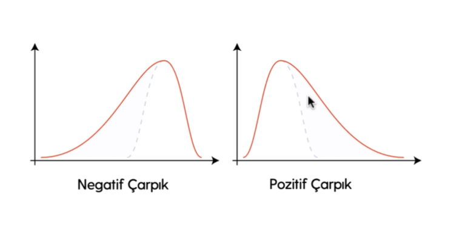
  
  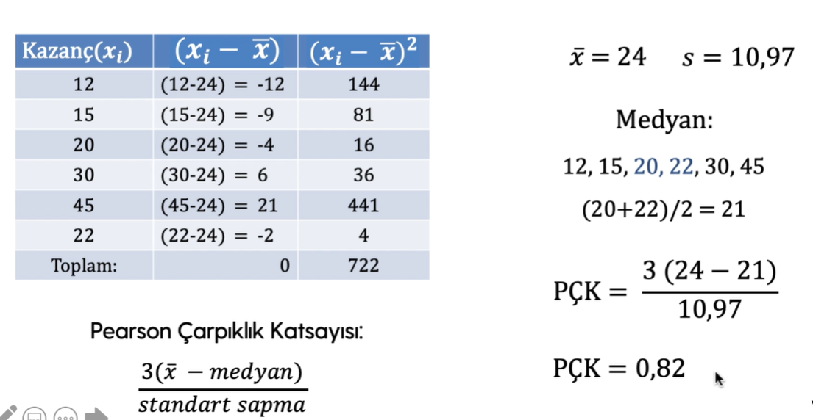

  ---

## Kurtosis(Basıklık)
- Elimizdeki değişkenin/serinin dağılımının sivri mi yoksa basık mı olduğunu ele alacağımızda kullanılır.
  
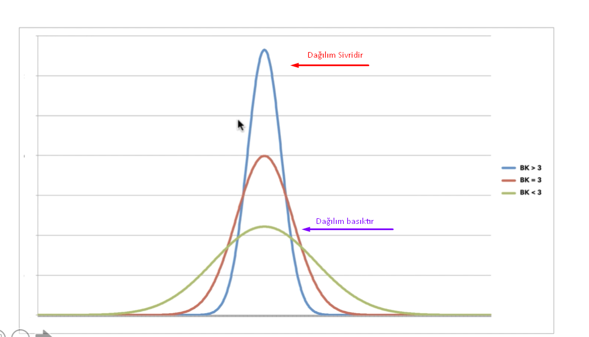
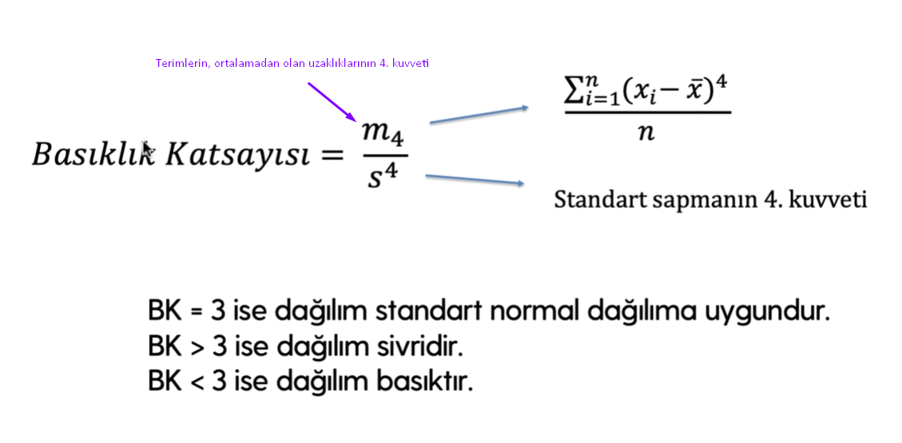

---

## Statistical Thinking Models(İstatistiksel Düşünce Modelleri)
- Veri okur yazarlığından, veri analitiğine giden yolu modelleyen yol göstericilerdir.
- Bu modeller akademik anlamda, istatistik kurumlarınca öğrencilerin analitik düşünce becerilerini veri analitiği kapsamında belirli bir programatik şema ile ele almayı sağlayan sağlayan, akademik modellerdir.
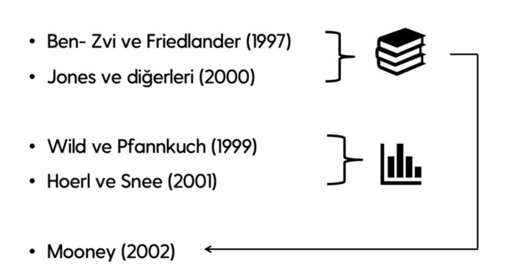
- Bu modellerin genel amacı, bir bireyin veriye ilk dokunduğu andan, son aşaması olan veriyle ilgili yorumlar yapabilme analitik çıkarımlarda bulunabilme süreçlerini modelleyen teorik çalışmalardır.
  
**Mooney Modeli**:
1- Verinin tanımlanması
2- Verinin organize edilmesi ve indirgenmesi
3- Veri gösterimi
4- Verinin analiz edilmesi ve yorumlanması

> Eğer verileri ölçülebilir metriklere çevirebilirsek, bunun neticesinde ölçüm yaptıktan sonra elde ettiğimiz değerleri, bir de istatistiksel düşünce seviyelerine göre değerlendirme imkanına sahip oluruz.

**İstatistiksel Düşünce Seviyeleri:**
- **Kişiye Özgülük (Seviye 1):** Genellikle kişiler, veri setlerine şöyle bir bakıp verideki değişkenleri vb. ilk temas noktalarındaki yorumlamaları yapamıyor oluyor. Örneğin ortalamaya bakılır ama ne anlama gelindiği hakkında fikrin olmaması gibi. Yani verinin ilk temas noktalarındaki okuryazarlık anlamındaki yorumlamalardan yoksun olunmasıdır.

- **Geçici (Seviye 2):** Nicel düşünmenin öneminin fark edilmeye başlandığı basamak ve her zaman doğru olmasada merkezi eğilim ve yayılım ölçüleri yorumlanabilir ve sayılarla ifade edilebilir bir hale gelir. Ama veri üzerindeki bakış açısı tek yönlüdür. Veri temsilleri veya verinin analizine yönelik olarak bağlantıların çok kurulamadığı bir seviyedir.
  
- **Nicel (Seviye 3):** Merkezi eğilim ve yayılım ölçülerinin doğru bir şekilde anlaşılmaya başlandığı bir seviyedir. Ve istatistiksel kararlar alabilmek için genellikle bu nicel verilere başvurabilme muhakemesinin pekiştiği basamaktır. Bağlam ve verinin ikisininde bilincinde olunması ve bu kavramlar arasında ufak ufak ilişkiler kurulmaya başlanmasını ifade eder. 
  
- **Analitik(Seviye 4):** Artık veriyi incelemeye, analiz etme ve yorumlamada tam anlamıyla analitik yaklaşım kullanılır. Ortlama nedir? Medyan nedir? Bunların birbirleriyle farkları nedir? Standart sapma nedir? Varyant nedir? Bu soruları bilinebilir bir hale gelir.

---