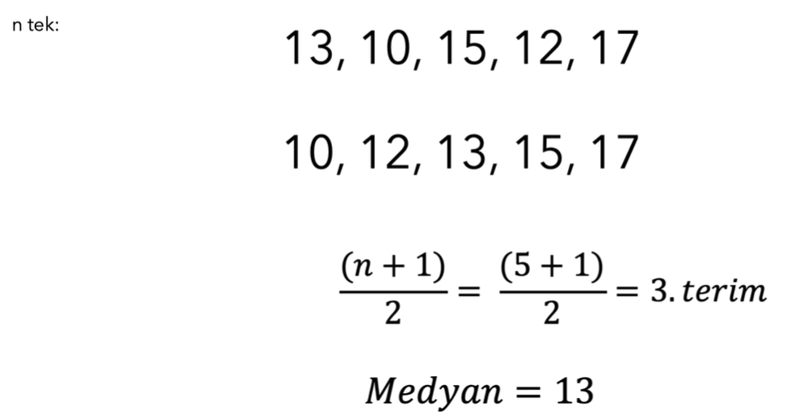
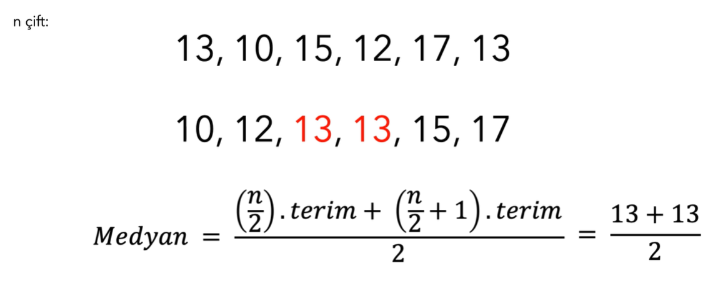

# Data Literacy (Veri OkurYazarlığı)
## Veri Okuryazarlığı Nedir?
- Günlük hayatta veriyle temas ettiğimiz ilk anlardaki basit veri yorumlama kabiliyetidir.
- Her türden veri tipini, değişken ve ölçek türlerini tanımlayabilme, betimsel istatistikleri ve istatistiksel grafikleri kullanarak ve değerlendirebilme yeteneğidir.

---

## Population and Sample(Popülasyon ve Örneklem):
- Popülasyon ilgilendiğimiz ana kitledir.
- Örneklem, bu Popülasyondan seçilmiş bir alt kümedir.
  &rarr; Burada önemli olan nokta, **örneklemin** ana kitleyi yani **popülasyonu** çok iyi temsil etmesi gerekir. Gün sonunda örneklem, bu popülasyonmuşcasına muamele görecektir.

- Seçim anketleri bir örnektir. 80 milyonu temsil ettiği varsayılan (mesela)2500 kişi üzerinden anket yapılır ve bu anket sonuçları tüm Türkiye sonuçları olarak yayınlanır.

---

## Observation Unit(Gözlem Birimi)
- Gözlem birimi araştırmada incelediğimiz birimlerdir. Bir **popülasyondan** seçtiğimiz **örneklem** topluluğundaki her bir eleman, **gözlem birimi** olarak adlandırılır.
- Anket yapılan her birey gözlem birimidir.

---

## Variable and Variable Types(Değişken ve Değişken Türleri)
**Değişken**: Birimden birime farklı değerler alan niceliktir.
- Örneğin birkaç arabanın KM değerleri olduğunu düşünürsek, KM'ye **değişken** diyebiliriz. 
- Vites türü, Araç fiyatı hepsi birer değişkendir.

**Değişken Türleri:**
1. Sayısal Değişken (nicel, kantitatif)
2. Kategorik Değişkenler (nitel, kalitatif)
   
- "Cinsiyet" kategorik değişkendir. "Kadın", "Erkek" ise bu kategorik değişkenin sınıflarıdır.

Not: Karakterlerden oluşan değişkenlere kategorik değişkenler denir.

---

## Scales of Measurement(Ölçek Türleri)
**Ölçek:** Bir değişkenin değerlerini insan olarak okuyup anlayabilmemiz için bunu ölçmemiz gerekir.

**Ölçek Türleri**
- Sayısal değişkenler için: Aralık ve Oran
- Kategorik değişkenler için: Nominal ve Ordinal

**Aralık Türü**: Sıcaklık gibi başlangıç noktası sıfır(0) olmayan sayısal değişkenlerin ölçek türü *Aralık*tır.

**Oran Türü**: Başlangıç noktası sıfır kabul edilen sayısal değişkenlerin ölçek türü *Oran*dır. Aracın KM değeri gibi.

**Nominal Türü**: Kategorik değişkenlerin sınıfları arasında fark olmadığında buna ***Nominal*** ölçek türü ile ölçülmüştür denir.
- Örneğin "Cinsiyet" kategorisindesi "Erkek" ve "Kadın" sınıfları arasında fark yoktur. Bunlar Nominal ölçek ile ölçülmüştür.

**Ordinal Türü**: Kategorik değişkenlerin sınıfları arasında fark olduğunda buna ***Ordinal*** ölçek türü ile ölçülmüştür denir.
- Örneğin rütbeler sınıflandırıldığında Teğmen < Üsteğmen < ... < Tuğgeneral < Tümgeneral < Korgeneral < Orgeneral
- Başka bir örnekte eğitim durumu için verilebilir: ilkokul < ortaokul < lise < üniversite

---

## Arithmetic Mean(Aritmetik Ortalama)
**Aritmetik ortalama:** Bir seride(değişkende) yer alan tüm değerlerin toplanması ve birim sayısına bölünmesi ile elde edilen istatistiktir.
Örneğin;

---

## Median(Medyan)
**Medyan**: Bir seriyi küçükten büyüğe veya büyükten küçüğe sıraladğımazda tam orta noktadan seriyi iki eşit parçaya ayıran değere medyan denir. 
- Elimizdeki değişken veya serinin, merkezi eğilimiyle ilgili bilgi almak için kullanılır. 
- Medyanı hesaplamak için bir seriye odaklandığımızda serinin içermiş olduğu gözlem sayısına göre medyan hesaplama işlemleri farklılık gösterir:

- Eğer elimizdeki seri simetrik ise ancak o zaman bu seri ile ilgili aritmetik ortalama hesaplanabilir. Eğer elimizdeki seri yada değişkenin dağılımı simetrik değil ise bu durumda medyan hesaplanabilir. Çünkü elimizdeki serinin merkezini temsil eden bir değer arıyoruz. Eğer simetrik değilse ortalama yanıltıcı olabilir.
  

- İş hayatında veri ile konuşurken, merkezi eğilim ölçüleriyle konuşurken eğer medyan ve ortalama bahsi açıldıysa **mutlaka ve mutlaka** muhattaplara, ya ***"dağılım simetrik mi?"*** diye sormak gerek ya da muhttaplara bilgi verirken:
***"dağılım incelendiğinde dağılımın simetrik olduğu gözükmektedir. Bu sebeple aritmetik ortalaması budur."*** 
VEYA 
***"Dağılım incelendiğinde veri seti içerisinde bulunan bazı aykırılıklardan vb. sebeplerden dolayı ortaya simetrik olmama problemi çıkmıştır, bu sebeple bu değişkenin temsili değeri olarak medyan değerini sunuyorum, o değer de şudur"*** şeklinde bir sunum yapılması gerekmektedir.

---

## Mode(Mod)
Bir seride yada değişkende en çok tekrar eden değişkene **mod** adı verilir.
- Biraz daha algoritmik bir işlemdir.
  

---
