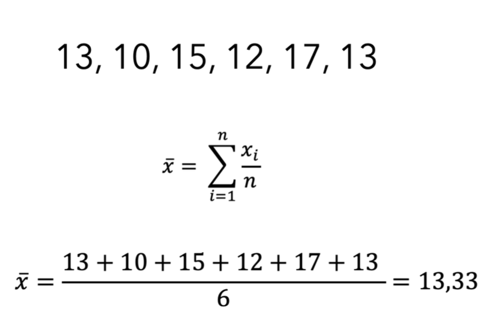

# Data Literacy (Veri OkurYazarlığı)
**Veri Okuryazarlığı Nedir?**
- Günlük hayatta veriyle temas ettiğimiz ilk anlardaki basit veri yorumlama kabiliyetidir.
- Her türden veri tipini, değişken ve ölçek türlerini tanımlayabilme, betimsel istatistikleri ve istatistiksel grafikleri kullanarak ve değerlendirebilme yeteneğidir.

---

**Population and Sample(Popülasyon ve Örneklem):**
- Popülasyon ilgilendiğimiz ana kitledir.
- Örneklem, bu Popülasyondan seçilmiş bir alt kümedir.
  &rarr; Burada önemli olan nokta, **örneklemin** ana kitleyi yani **popülasyonu** çok iyi temsil etmesi gerekir. Gün sonunda örneklem, bu popülasyonmuşcasına muamele görecektir.

- Seçim anketleri bir örnektir. 80 milyonu temsil ettiği varsayılan (mesela)2500 kişi üzerinden anket yapılır ve bu anket sonuçları tüm Türkiye sonuçları olarak yayınlanır.

---

**Observation Unit(Gözlem Birimi)**
- Gözlem birimi araştırmada incelediğimiz birimlerdir. Bir **popülasyondan** seçtiğimiz **örneklem** topluluğundaki her bir eleman, **gözlem birimi** olarak adlandırılır.
- Anket yapılan her birey gözlem birimidir.

---

**Variable and Variable Types(Değişken ve Değişken Türleri)**
**Değişken**: Birimden birime farklı değerler alan niceliktir.
- Örneğin birkaç arabanın KM değerleri olduğunu düşünürsek, KM'ye **değişken** diyebiliriz. 
- Vites türü, Araç fiyatı hepsi birer değişkendir.

**Değişken Türleri:**
1. Sayısal Değişken (nicel, kantitatif)
2. Kategorik Değişkenler (nitel, kalitatif)
   
- "Cinsiyet" kategorik değişkendir. "Kadın", "Erkek" ise bu kategorik değişkenin sınıflarıdır.

Not: Karakterlerden oluşan değişkenlere kategorik değişkenler denir.

---

**Scales of Measurement(Ölçek Türleri)**
**Ölçek:** Bir değişkenin değerlerini insan olarak okuyup anlayabilmemiz için bunu ölçmemiz gerekir.

**Ölçek Türleri**
- Sayısal değişkenler için: Aralık ve Oran
- Kategorik değişkenler için: Nominal ve Ordinal

**Aralık Türü**: Sıcaklık gibi başlangıç noktası sıfır(0) olmayan sayısal değişkenlerin ölçek türü *Aralık*tır.

**Oran Türü**: Başlangıç noktası sıfır kabul edilen sayısal değişkenlerin ölçek türü *Oran*dır. Aracın KM değeri gibi.

**Nominal Türü**: Kategorik değişkenlerin sınıfları arasında fark olmadığında buna ***Nominal*** ölçek türü ile ölçülmüştür denir.
- Örneğin "Cinsiyet" kategorisindesi "Erkek" ve "Kadın" sınıfları arasında fark yoktur. Bunlar Nominal ölçek ile ölçülmüştür.

**Ordinal Türü**: Kategorik değişkenlerin sınıfları arasında fark olduğunda buna ***Ordinal*** ölçek türü ile ölçülmüştür denir.
- Örneğin rütbeler sınıflandırıldığında Teğmen < Üsteğmen < ... < Tuğgeneral < Tümgeneral < Korgeneral < Orgeneral
- Başka bir örnekte eğitim durumu için verilebilir: ilkokul < ortaokul < lise < üniversite

---

**Arithmetic Mean(Aritmetik Ortalama)**
**Aritmetik ortalama:** Bir seride(değişkende) yer alan tüm değerlerin toplanması ve birim sayısına bölünmesi ile elde edilen istatistiktir.
Örneğin;

---