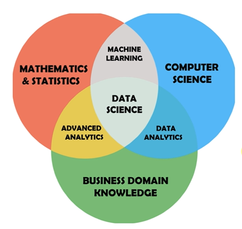
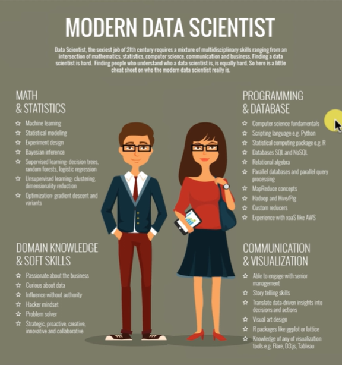
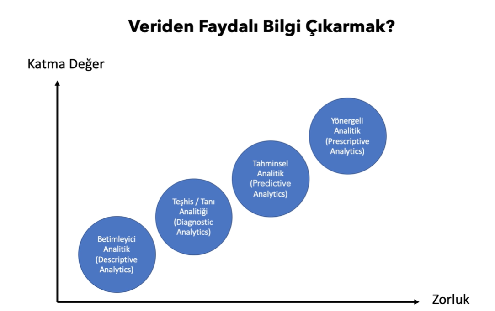
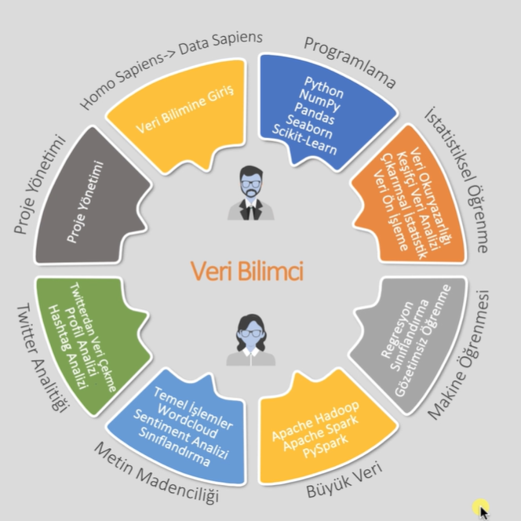

# Veri Bilimi ve Machine Learning Kursu Başlıyor!

> Bu dosya'da gün gün ve proje proje kendi öğrendiklerimi, yaptığım projeleri paylaşacağım.

> Tarih: 01-07-2024

- Veri bilimi veriden faydalı bilgi çıkarma sürecidir.
-  Veri bilimi proje süreçleri:
    Veri kaynakları &rarr; Veri Analitiği &rarr; Bilgi &rarr; Aksiyon

 ---

- Makine öğrenmesinde amacımız; genellenebilir, yansız ve tahmin başarısı yüksek modeller kurmaktır.

---

---

**Teşhis/Tanı Analitiği (Diagnostic Analytics):** 
 - Neden olmuş sorusuna cevap ararız.
 - Örn:Satışlar neden artmış 
  
**Tahminsel Analitik(Diagnostic Analytics):**
- Ne olacak sorusuna yanıt ararız.
- Örn: Çalışan performansına göre mantıklı görev vermek.
- Örn: Terk edecek müşteriyi tahmin etmek.
  
**Yönergeli Analitik(Perspective Analiytics):**
- Nasıl olmalı sorusuna yanıt ararız.
- Örn: Ne yaparsan müşteriyi kaybetmezsin?

---

**Örnek olarak**, Araç fiyatı tahmin modelinde kullanılacak veri ***ilişkisel veritabanlarında(SQL)*** bulunur. Eğer ilişkisel veri tabanlarında tutulamayacak boyutta ve türdeyse bu veri ***Büyk veri ortamlarındadır.***

---

- Veri bilimi bir ***süreçtir***. Yapay zeka ***ürünleşmiş son nokta*** olarak görülür.
  

---

